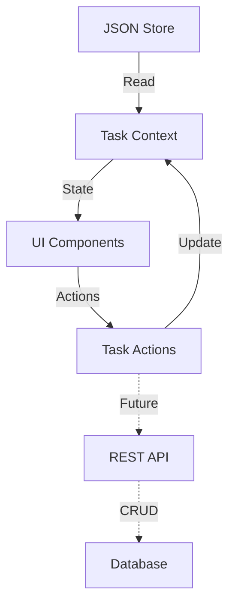

# API & Data Flow Specifications

## Data Flow Architecture

### 1. Task Data Management
- Currently using local JSON storage
- Future API endpoints planned for CRUD operations



## Current Data Structure

### Tasks JSON Format
```json
{
  "tasks": [
    {
      "id": "string",
      "task_name": "string",
      "effort": "number",
      "priority_order": "number",
      "pic": "string",
      "start_date": "string (ISO)",
      "end_date": "string (ISO)",
      "status": "active|pending|completed",
      "pending_periods": [
        {
          "start": "string (ISO)",
          "end": "string (ISO)"
        }
      ]
    }
  ]
}
```

## Future API Endpoints

### Task Management
```typescript
// Base URL: /api/tasks

// GET /api/tasks
// List all tasks
Response {
  tasks: Task[]
}

// GET /api/tasks/:id
// Get single task
Response {
  task: Task
}

// POST /api/tasks
// Create new task
Request {
  task_name: string
  effort: number
  priority_order: number
  pic: string
}
Response {
  task: Task
}

// PUT /api/tasks/:id
// Update task
Request {
  task_name?: string
  effort?: number
  priority_order?: number
  pic?: string
  start_date?: string
  end_date?: string
  status?: TaskStatus
}
Response {
  task: Task
}

// PATCH /api/tasks/reorder
// Reorder multiple tasks
Request {
  task_orders: {
    id: string
    priority_order: number
  }[]
}
Response {
  tasks: Task[]
}

// POST /api/tasks/:id/status
// Update task status
Request {
  status: TaskStatus
  pending_start?: string  // Required if status === 'pending'
  pending_end?: string    // Required if status === 'active' & was pending
}
Response {
  task: Task
}
```

### Schedule Management
```typescript
// GET /api/schedule
// Get current schedule
Response {
  schedule: {
    tasks: Task[]
    start_date: string
    end_date: string
  }
}

// POST /api/schedule/recalculate
// Recalculate schedule
Request {
  start_date?: string  // Optional new start date
  tasks?: string[]     // Optional subset of task IDs
}
Response {
  schedule: {
    tasks: Task[]
    start_date: string
    end_date: string
  }
}
```

## State Management

### Local Storage
- Persist task state between sessions
- Store user preferences
- Cache schedule calculations

### Real-time Updates
- Future WebSocket integration for collaborative features
- Event types:
  ```typescript
  type TaskEvent = {
    type: 'task_updated' | 'task_reordered' | 'schedule_changed'
    payload: any
  }
  ```

## Error Handling

### API Error Format
```typescript
type APIError = {
  code: string
  message: string
  details?: {
    field?: string
    reason?: string
  }[]
}
```

### Common Error Codes
```typescript
enum ErrorCode {
  INVALID_REQUEST = 'INVALID_REQUEST',
  TASK_NOT_FOUND = 'TASK_NOT_FOUND',
  SCHEDULE_CONFLICT = 'SCHEDULE_CONFLICT',
  INVALID_STATUS_TRANSITION = 'INVALID_STATUS_TRANSITION',
  INTERNAL_ERROR = 'INTERNAL_ERROR'
}
```

## Data Validation

### Task Validation Rules
```typescript
const taskValidation = {
  task_name: {
    required: true,
    max_length: 100
  },
  effort: {
    required: true,
    min: 1,
    max: 1000
  },
  priority_order: {
    required: true,
    min: 1
  },
  pic: {
    required: true,
    max_length: 50
  },
  start_date: {
    format: 'ISO8601'
  },
  end_date: {
    format: 'ISO8601',
    after: 'start_date'
  }
}
```

## Security Considerations

### Future Authentication
- JWT-based authentication
- Role-based access control
- Endpoint permission matrix:
  ```
  GET /tasks - All users
  POST /tasks - Admin only
  PUT /tasks/:id - Task owner or admin
  PATCH /tasks/reorder - Task owner or admin
  ```

### Data Sanitization
- Input validation middleware
- XSS prevention
- SQL injection protection (when DB is added)

## Performance Optimization

### Caching Strategy
- Cache schedule calculations
- Cache task lists
- Invalidate on:
  - Task updates
  - Priority changes
  - Status changes

### Batch Operations
- Bulk task updates
- Schedule recalculations
- Priority reordering
