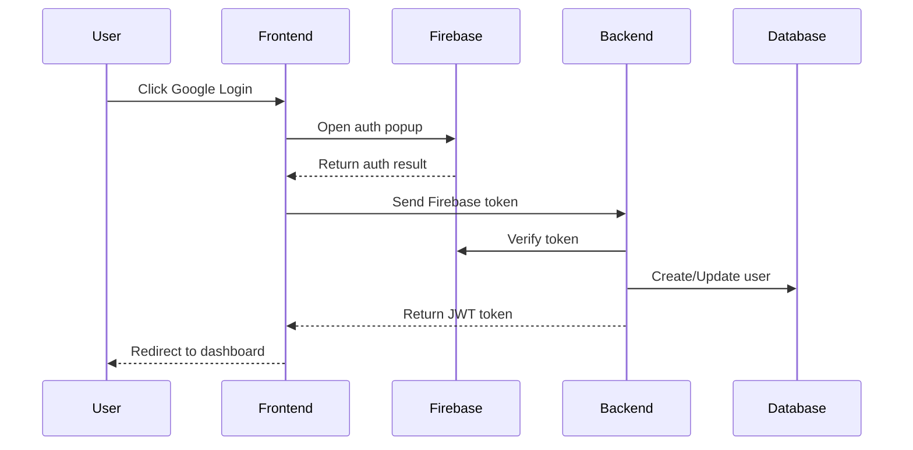
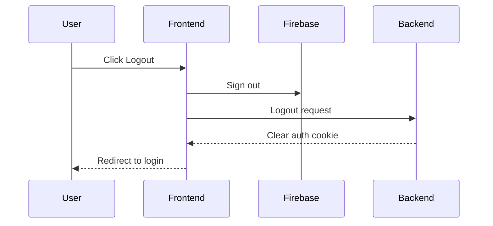

# Firebase Authentication Integration

## Overview
This document describes how Firebase Authentication is integrated with our backend system and how users are synchronized with our database.

## Architecture

### Frontend
1. Firebase SDK handles the authentication flow
2. After successful auth, frontend gets Firebase ID token
3. Token is sent to backend for verification and user sync
4. JWT token from backend is stored in HTTP-only cookie

### Backend
1. Verifies Firebase ID token
2. Creates or updates user in database
3. Issues JWT token for subsequent requests

## Setup Requirements

### Frontend Environment Variables
```env
NEXT_PUBLIC_FIREBASE_API_KEY=
NEXT_PUBLIC_FIREBASE_AUTH_DOMAIN=
NEXT_PUBLIC_FIREBASE_PROJECT_ID=
NEXT_PUBLIC_FIREBASE_STORAGE_BUCKET=
NEXT_PUBLIC_FIREBASE_MESSAGING_SENDER_ID=
NEXT_PUBLIC_FIREBASE_APP_ID=
```

### Backend Environment Variables
```env
FIREBASE_PROJECT_ID=
FIREBASE_SERVICE_ACCOUNT_PATH=
```

## Authentication Flow

1. User Login


2. User Logout


## Database Schema

User table includes these Firebase-related fields:
- `firebase_uid`: Unique identifier from Firebase
- `email_verified`: Boolean indicating email verification status 
- `provider`: Authentication provider (google, email, etc.)

## Error Handling

1. Invalid/Expired Token
- Backend returns 401 Unauthorized
- Frontend redirects to login page

2. Firebase Service Unavailable
- Backend returns 503 Service Unavailable
- Frontend shows error message

## Testing

1. Unit Tests
- Token verification
- User synchronization
- Error scenarios

2. Integration Tests
- Complete auth flow
- Token refresh
- Logout flow

## Security Considerations

1. Token Validation
- Verify issuer (iss)
- Verify audience (aud)
- Check token expiration
- Validate signature

2. Cookie Security
- HTTP-only flag
- Secure flag in production
- SameSite attribute

3. CORS Configuration
- Restrict to known domains
- Handle preflight requests